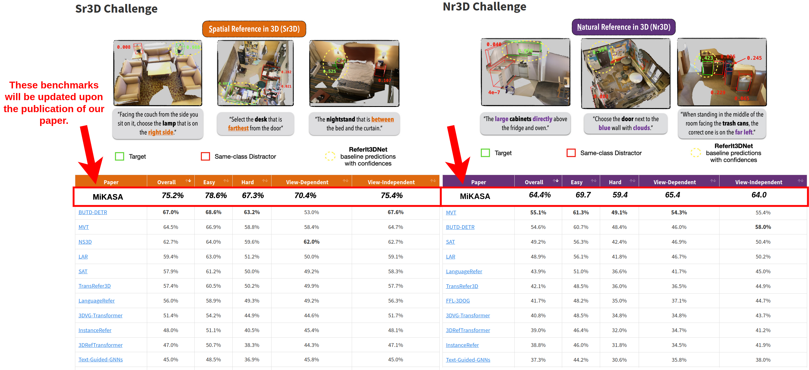
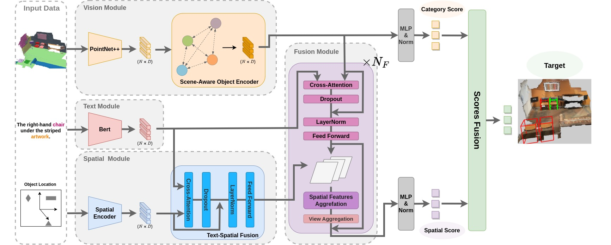

# **MiKASA**: **M**ult**i**-**K**ey-**A**nchor & **S**cene-**A**ware Transformer <br> for 3D Visual Grounding
## *[CVPR 24]* *[Papaer ID:11446]*
## News
- 🚩 As of the time of this submission, our model has established a new state-of-the-art benchmark in the [ReferIt3D challenge](https://referit3d.github.io/benchmarks.html), achieving top performance across all categories in both the Nr3D and Sr3D datasets. These benchmarks will be updated following the publication of our paper. 
<p align="center">
  
</p>

## We will make our code available upon the paper's publication.

 
## 1. Data Preparation
### 1.1. ScanNet Data
To download the ScanNet scans, see [ScanNet](https://github.com/ScanNet/ScanNet#scannet-data) for the instruction.
To preprocess the datarequired for Referit3D challenge, visit [ReferIt3D](https://github.com/referit3d/referit3d)

### 1.2. Referit3D Linguistic Data (Nr3D/Sr3D/Sr3D+)
 See [ReferIt3D](https://github.com/referit3d/referit3d) for more details.
* [**Nr3D**](https://drive.google.com/file/d/1qswKclq4BlnHSGMSgzLmUu8iqdUXD8ZC/view?usp=sharing) (10.7MB)
* [**Sr3D**](https://drive.google.com/drive/folders/1DS4uQq7fCmbJHeE-rEbO8G1-XatGEqNV?usp=sharing) (19MB)
* [**Sr3D+**](https://drive.google.com/drive/folders/1DS4uQq7fCmbJHeE-rEbO8G1-XatGEqNV?usp=sharing) (20MB)
 

### 1.3. Pre-trained weight of Bert
Please down load the pre-trained weight at [Huggingface](https://huggingface.co/bert-base-uncased/tree/main)
### 1.4. Directory Structure

The final required files are as follows:
```
MiKASA/
│────────── logs/ # Training logs
│────────── external_tools/
|           │────────── pointnet2/
|           └── ...
|────────── models/
|────────── scripts/
|           │────────── train_referit3d.py
|           └── ...
|────────── utils/
└── ...
```

## 2. Environment
* Ubuntu: 20.04
* CUDA: 11.7
* PyTorch: 1.13
* python: 3.7

## 3. Installation
* To use a PointNet++ visual-encoder you need to compile its CUDA layers for [PointNet++](http://arxiv.org/abs/1706.02413):
```Note: To do this compilation also need: gcc5.4 or later.```
```Console
    cd external_tools/pointnet2
    python setup.py install
```
For the dependencies, see [environment.yaml](environment.yaml). 

## 4. Models

|Dataset  | Model | Log
|:---:|:---:|:---:|
|SR3D | -- | --
|NR3D | -- | --

*The link of the checkpoint will be updated after our paper's publication to maintain the anonymity of the review process.*
## 5. Run
### 5.1. Training
* To train on either Nr3d or Sr3d dataset, use the following commands
```Console
    python scripts/train_referit3d.py \
    -scannet-file $PATH_OF_SCANNET_FILE$ \
    -referit3D-file $PATH_OF_REFERIT3D_FILE$ \
    --bert-pretrain-path $PATH_OF_BERT$ \
    --resume-path $PATH_OF_CHECKPOINT(optional)$
    --log-dir logs/$NAME(optional)$ \
    --config-file  $PATH_OF_CONFIG_FILE$
```
### 5.2. Evaluation
* To evaluate on either Nr3d or Sr3d dataset, plese add the following arguments
```Console
    --resume-path $PATH_OF_CHECKPOINT$ \
    --mode evaluate
```
## Credits
The project is built based on the following repository:
* [ReferIt3D](https://github.com/referit3d/referit3d)
* [MVT](https://github.com/sega-hsj/MVT-3DVG)

